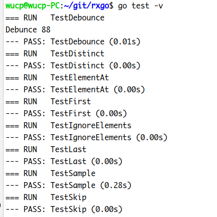
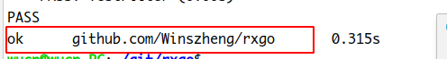

# 设计文档

## 一、设计说明

### 1 需求说明

阅读 ReactiveX 文档。请在 [pmlpml/RxGo](https://github.com/pmlpml/rxgo) 基础上，

- 修改、改进它的实现

- 或添加一组新的操作，如 [filtering](http://reactivex.io/documentation/operators.html#filtering)

本程序包的选择是：增加一组filtering操作。

### 2 前置了解

#### 2.1 阅读老师的包文件

##### rxgo.go

给出了基础类型、抽象定义、框架实现、debug工具等

##### transform.go

给出transOperater的通用实现和具体函数实现

##### generators.go

给出了 sourceOperater 的通用实现和具体函数实现

##### utility.go

给出各个功能函数的实现

### 3 关于filtering操作

从源被观察者选择性地发出操作符

- [**`Debounce`**](http://reactivex.io/documentation/operators/debounce.html) — only emit an item from an Observable if a particular timespan has passed without it emitting another item
- [**`Distinct`**](http://reactivex.io/documentation/operators/distinct.html) — suppress duplicate items emitted by an Observable
- [**`ElementAt`**](http://reactivex.io/documentation/operators/elementat.html) — emit only item *n* emitted by an Observable
- [**`Filter`**](http://reactivex.io/documentation/operators/filter.html) — emit only those items from an Observable that pass a predicate test
- [**`First`**](http://reactivex.io/documentation/operators/first.html) — emit only the first item, or the first item that meets a condition, from an Observable
- [**`IgnoreElements`**](http://reactivex.io/documentation/operators/ignoreelements.html) — do not emit any items from an Observable but mirror its termination notification
- [**`Last`**](http://reactivex.io/documentation/operators/last.html) — emit only the last item emitted by an Observable
- [**`Sample`**](http://reactivex.io/documentation/operators/sample.html) — emit the most recent item emitted by an Observable within periodic time intervals
- [**`Skip`**](http://reactivex.io/documentation/operators/skip.html) — suppress the first *n* items emitted by an Observable
- [**`SkipLast`**](http://reactivex.io/documentation/operators/skiplast.html) — suppress the last *n* items emitted by an Observable
- [**`Take`**](http://reactivex.io/documentation/operators/take.html) — emit only the first *n* items emitted by an Observable
- [**`TakeLast`**](http://reactivex.io/documentation/operators/takelast.html) — emit only the last *n* items emitted by an Observable

### 4 具体实现

##### 过滤操作结构体

```
type filterOperator struct {
	opFunc func(ctx context.Context, o *Observable, item reflect.Value, out chan interface{}) (end bool)
}
```

##### 修改已有的op函数

```
// op将前一个被观察者的输入流当作本被观察者的输入
func (tsop transOperater) op(ctx context.Context, o *Observable) {
   // must hold defintion of flow resourcs here, such as chan etc., that is allocated when connected
   // this resurces may be changed when operation routine is running.
   in := o.pred.outflow
   out := o.outflow
   //fmt.Println(o.name, "operator in/out chan ", in, out)
   var wg sync.WaitGroup

   go func() {
      end := false
      for x := range in {
         if end {
            continue
         }
         // can not pass a interface as parameter (pointer) to gorountion for it may change its value outside!
         xv := reflect.ValueOf(x)
         // send an error to stream if the flip not accept error
         if e, ok := x.(error); ok && !o.flip_accept_error {
            o.sendToFlow(ctx, e, out)
            continue
         }
         // scheduler
         switch threading := o.threading; threading {
         case ThreadingDefault:
            if tsop.opFunc(ctx, o, xv, out) {
               end = true
            }
         case ThreadingIO:
            fallthrough
         case ThreadingComputing:
            wg.Add(1)
            go func() {
               defer wg.Done()
               if tsop.opFunc(ctx, o, xv, out) {
                  end = true
               }
            }()
         default:
         }
      }

      if o.flip != nil {
         buf, ok := reflect.ValueOf(o.flip).Interface().([]reflect.Value)
         if !ok {
            panic("buffer is not a slice")
         }
         for _, v := range buf {
            o.sendToFlow(ctx, v.Interface(), out)
         }
      }
      
      // 等待所有go程结束并关闭outflow
      wg.Wait() 
      o.closeFlow(out)
   }()
}
```

##### Debouce

保留每个输入流中的item，按规定的时间间隔输出。这里用time.Sleep实现时延。

```
// Debounce间隔timespan时间输出item；
func (parent *Observable) Debounce(timespan time.Duration) (o *Observable){
   o = parent.newTransformObservable("Debounce")
   o.threading = ThreadingComputing
   count := 0
   o.operator = filterOp{
      func(ctx context.Context, o *Observable, item reflect.Value, out chan interface{}) (end bool){
         count++
         var tempCount = count
         time.Sleep(timespan)
         if tempCount == count{
            end = o.sendToFlow(ctx, item.Interface(), out)
         }
         return
      }}
   return o
}
```

##### Distinct

去除输入流中的重复item

```
// Distinct去除输入流中的重复item
func (parent *Observable) Distinct()(o *Observable){
   o = parent.newTransformObservable("Distinct")
   var uni = map[string]bool{}
   o.operator = filterOp{
      func(ctx context.Context, o *Observable, item reflect.Value, out chan interface{}) (end bool){
         itemStr := fmt.Sprintf("%v", item)
         if _, ok := uni[itemStr]; !ok{
            uni[itemStr] = true
            end = o.sendToFlow(ctx, item.Interface(), out)
         }
         return false
      }}
   return o
}
```

##### ElementAt

返回对应下标的元素(从0开始)

```
// ElementAt 返回第id位的元素
func (parent *Observable) ElementAt (id int)(o *Observable){
   o = parent.newTransformObservable("ElementAt")
   count := 0
   o.operator = filterOp{
      func(ctx context.Context, o *Observable, item reflect.Value, out chan interface{}) (end bool){
         if count == id{
            end = o.sendToFlow(ctx, item.Interface(), out)
         }
         count++
         return
      }}
   return o
}
```

##### Filter

```
// First发射首位元素
func (parent *Observable) First ()(o *Observable){
   o = parent.newTransformObservable("First")
   o.operator = filterOp{
      func(ctx context.Context, o *Observable, item reflect.Value, out chan interface{}) (end bool){
         o.sendToFlow(ctx, item.Interface(), out)
         return true
      }}
   return o
}
```

##### First

返回首位元素。

```
// First发射首位元素
func (parent *Observable) First ()(o *Observable){
	o = parent.newTransformObservable("First")
	o.operator = filterOp{
		func(ctx context.Context, o *Observable, item reflect.Value, out chan interface{}) (end bool){
			o.sendToFlow(ctx, item.Interface(), out)
			return true
		}}
	return o
}
```

##### IgnoreElements

无视输入流中所有item，返回报错信息/结束信息

```
// IgnoreElements忽略输入流中所有item，只发送报错结束/结束信息；
func (parent *Observable) IgnoreElements ()(o *Observable){
   o = parent.newTransformObservable("IgnoreElements")
   o.operator = filterOp{
      func(ctx context.Context, o *Observable, item reflect.Value, out chan interface{}) (end bool){
         return
      }}
   return o
}
```

##### Last

返回末位信息

```
// last发射末位元素
func (parent *Observable) Last()(o *Observable){
   o = parent.newTransformObservable("last")
   o.operator = filterOp{
      func(ctx context.Context, o *Observable, item reflect.Value, out chan interface{}) (end bool){
         o.flip = append([]interface{}{}, item.Interface())
         return false
      }}
   return o
}
```

##### Sample

```
// Sample定期发射被观察者最近发射的数据项
func (parent *Observable) Sample(timespan time.Duration)(o *Observable){
   o = parent.newTransformObservable("Sample")
   o.threading = ThreadingComputing    //2
   temp := make([]reflect.Value, 256)
   timer := false
   var wa sync.WaitGroup
   count := 0
   span := + 50*time.Millisecond
   o.operator = filterOp{
      opFunc:func(ctx context.Context, o *Observable, item reflect.Value, out chan interface{}) (end bool){
         temp[count] = item
         count++
         if !timer{
            wa.Add(1)
            go func() {
               defer wa.Done()
               for {
                  time.Sleep(timespan + span)
                  select{
                  case <-ctx.Done():
                     return
                  default:
                     if count == 0 {
                        return
                     }
                     if o.sendToFlow(ctx, temp[count-1].Interface(), out){
                        return
                     }
                     count = 0
                  }
               }
            }()
            timer = true
            wa.Wait()
         }
         return false

      }}
   return o
}
```

##### Skip

```
// skip跳过前n项
func (parent *Observable) Skip (n int)(o *Observable){
   o = parent.newTransformObservable("Skip")
   index := 0
   o.operator = filterOp{
      opFunc:func(ctx context.Context, o *Observable, item reflect.Value, out chan interface{}) (end bool){
         if index >= n{
            end = o.sendToFlow(ctx, item.Interface(), out)
         }
         index++
         return
      }}
   return o
}
```

##### SkipLast

```
// Skiplast跳过后n项发送
func (parent *Observable) Skiplast (n int)(o *Observable){
   o = parent.newTransformObservable("Skiplast")
   var temp []reflect.Value
   index := 0
   o.operator = filterOp{
      opFunc:func(ctx context.Context, o *Observable, item reflect.Value, out chan interface{}) (end bool){
         if index >= n{
            end = o.sendToFlow(ctx, temp[0].Interface(), out)
            temp = temp[1:]
         }
         index++
         temp = append(temp, item)
         return
      }}
   return o
}
```

##### Take

```
// Take只发射前n项
func (parent *Observable) Take (n int)(o *Observable){
   o = parent.newTransformObservable("Take")
   var index = 0
   o.operator = filterOp{
      func(ctx context.Context, o *Observable, item reflect.Value, out chan interface{}) (end bool){
         if index < n{
            end = o.sendToFlow(ctx, item.Interface(), out)
         }
         index++
         return
      }}
   return o
}
```

## 二、测试

为了节约测试代码行数，引入"github.com/stretchr/testify/assert"

#### 测试代码

```
package rxgo

import (
   "fmt"
   "os"

   "github.com/stretchr/testify/assert"
   "testing"
   "time"
)


func TestDebounce(t *testing.T){
   Just(0,3,4,5,6,7,8, 88).Map(func(x int)int{
      if x != 0{
         time.Sleep(1*time.Millisecond)
      }
      return x
   }).Debounce(2*time.Millisecond).Subscribe(func(x int){
      if x != 88 {
         fmt.Printf("error Debounce with %d\n", x)
         os.Exit(-1)
      }
      fmt.Printf("Debunce %d\n", x)
   })
}

func TestDistinct(t *testing.T){
   res := []int{}
   Just(1, 8, 9, 10, 1, 8, 8, 8, 8, 8).Map(func(x int) int {
      return x
   }).Distinct().Subscribe(func(x int) {
      res = append(res, x)
   })
   assert.Equal(t, []int{1, 8, 9, 10}, res, "TestDistinct Error!")
}

func TestElementAt(t *testing.T){
   Just("hello", "h","aa").ElementAt(0).Subscribe(func(x string){
      if x!= "hello" {
         fmt.Printf("TestElementAt Error with value = %s", x)
         os.Exit(1)
      }
   })
}

func TestFirst(t *testing.T) {
   Just(9,"b","c").First().Subscribe(func(x int) {
      if x != 9 {
         fmt.Printf("TestFirst Error with value: %d\n", x)
         os.Exit(1)
      }
   })
}

func TestIgnoreElements(t *testing.T){
   Just("aaa", "b", "100", "0", "mary", "peter").IgnoreElements().Subscribe(func(x string) {
      fmt.Printf("TestIgnoreElements Error with value: %s\n", x)
      os.Exit(1)
   })
}

func TestLast(t *testing.T){
   Just("aaa", "b", "100", "0", "mary", "peter").Last().Subscribe(func(x string) {
      if x != "peter" {
         fmt.Errorf("TestLast Error with value: %s\n", x)
         os.Exit(1)
      }
   })
}

func TestSample(t *testing.T){
   result := []int{2, 5, 8, 9}
   actual := []int{}
   Just(0,1,2,3,4, 5, 6, 7, 8, 9).Map(func(x int)int{
      time.Sleep(18*time.Millisecond)
      return x
   }).Sample(3*time.Millisecond).Subscribe(func(x int){
      actual = append(actual, x)
      fmt.Println("here: ",x)
   })
   assert.Equal(t, result, actual, "--same---")
}

func TestSkip(t *testing.T) {
   res := []int{}
   Just(10, 20, 30, 40, 50).Map(func(x int) int {
      return x
   }).Skip(4).Subscribe(func(x int) {
      res = append(res, x)
   })
   assert.Equal(t, []int{50}, res, "Skip Test Error!")
}
```

#### 测试结果





可见符合要求。